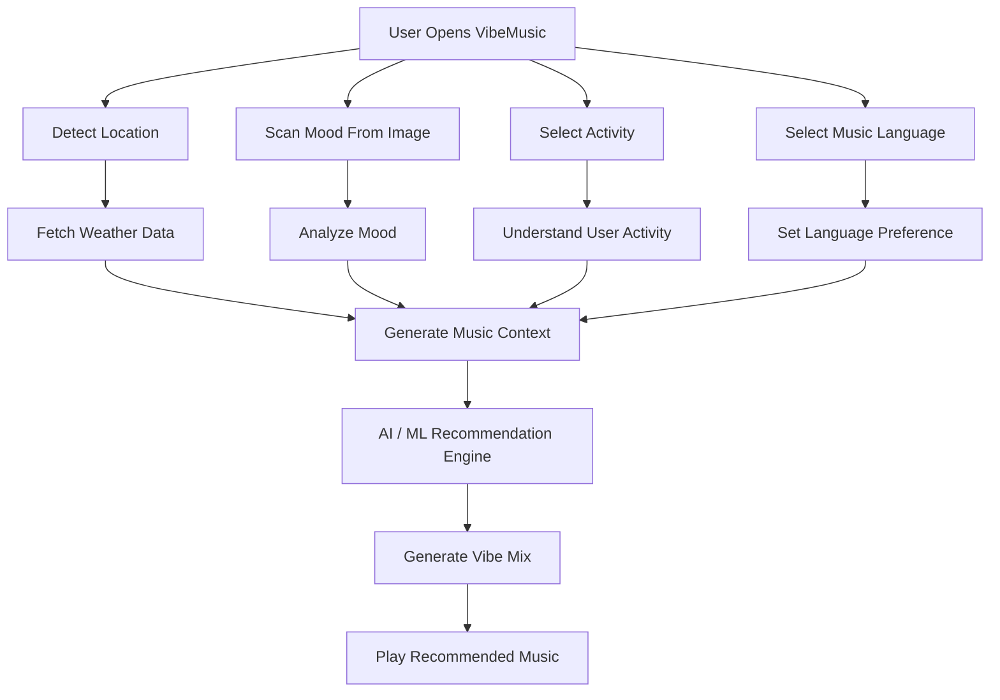

### AI-powered music recommendation engine that understands your mood, activity, location, and weather to generate adaptive real-time playlists.

 

---

## 📌 About The Project

**VibeMusic** is an AI-based music recommendation web application that generates music according to the user's real-time context.

The app detects or takes input from:

- 📍 User location  
- 🌦️ Current weather  
- 🙂 User mood from image/camera scan  
- 🏃 Current activity  
- 🌐 Preferred music language  

Based on these signals, VibeMusic creates a personalized music vibe and recommends songs that match the user's current environment and emotional state.

This project was developed in **two different approaches**:

1. **Google AI Studio / Gemini API based recommendation**
2. **Custom Machine Learning model trained using a Kaggle dataset**

The goal of this project is to understand how real-world recommendation engines can combine AI, weather data, mood detection, and user activity to generate smarter music experiences.

---

## 🖼️ Project Preview
---

### VibeMusic Web App UI

---

## 🚀 Features

- 🎵 AI-powered music recommendation
- 📸 Mood detection using user image/camera scan
- 📍 Location-based context detection
- 🌦️ Weather-aware music generation
- 🏃 Activity-based playlist recommendation
- 🌐 Multi-language music preference
- 🤖 Gemini API integration
- 🧠 Custom ML model approach using Kaggle dataset
- ⚡ Fast Vite + React frontend
- 🎨 Modern dark neon UI
- 🎧 YouTube Music discovery support

---

## 🧠 How It Works

VibeMusic generates recommendations by combining multiple user-context signals.

# Run and deploy your AI Studio app

This contains everything you need to run your app locally.

View your app in AI Studio: https://ai.studio/apps/drive/1hO8awO9ExuJSuooAv0gAC4V2U0pGJI9q

## Run Locally

**Prerequisites:**  Node.js

1. Install dependencies:
   `npm install`
2. Set the `GEMINI_API_KEY` in [.env.local](.env.local) to your Gemini API key
3. Run the app:
   `npm run dev`
